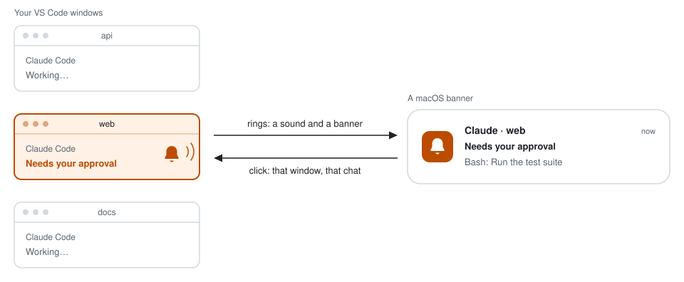

<div align="center">

# Doorbell for Claude Code

**Claude Code rings when it needs you.**

Doorbell plays a sound and shows a clickable macOS banner when Claude Code in VS Code needs
your approval, asks a question or finishes a turn.<br>
One click takes you to the right window and the right chat.

[](https://github.com/Slavic-Sensei/claude-code-doorbell/actions/workflows/ci.yml)
[](LICENSE)


<picture>
  <source media="(prefers-color-scheme: dark)" srcset="docs/assets/hero-dark.svg">
  
</picture>

An independent community project, not affiliated with or endorsed by Anthropic.

</div>

## Why Doorbell

Claude Code works for minutes at a stretch, so you look away: at another window, another
chat, your inbox. Then it stops and waits for you. It needs permission, has a question or
has finished. The only sign is a small dot on a tab you are not looking at. With a few
windows open, a chat can sit idle for a long time before you notice.

Doorbell gives every window a bell.

## What you get

Doorbell rings in four situations. A turn is one answer from Claude to one of your prompts.

| When Claude… | You hear | The banner says |
| --- | --- | --- |
| needs your approval to use a tool | Funk | **Needs your approval**, with the tool and what it is for |
| has a question or a plan for you | Funk | **Has a question for you** with the question, or **Plan ready for review** |
| finishes a turn that took 10 seconds or longer | Glass | **Finished — waiting for you**, with the first words of the reply |
| is stopped by an API error, such as a rate limit | Basso | **Stopped by an error**, with the error |

Every banner is titled with the project, for example **Claude · web**, so you know which
window is calling without opening it.

- **A click takes you there.** The VS Code window of that project comes forward and shows
  that chat.
- **One ring per prompt.** Claude Code can raise up to three events for a single prompt.
  Doorbell rings once.
- **A pause is not the end.** When a turn ends while agents or workflows it started are
  still running, you get a banner without a sound. The bell rings when the work is really
  done.
- **Quiet after a quick answer.** A turn shorter than 10 seconds ends without a sound or a
  banner. Doorbell goes by the clock alone: it cannot see whether you are looking at the
  chat. A prompt that needs you always rings.
- **Quiet for scripts.** Doorbell stays silent for `claude -p`, SDK scripts and cron jobs,
  because nobody is waiting at a window.
- **Heard in Focus.** A Focus mode hides the banner, but not the sound. For silence, turn
  on the `mute` option.
- **Out of the way.** Claude Code does not wait for Doorbell. Its hooks run in the
  background, return nothing and always exit with code 0.
- **Private.** Everything stays on your Mac. No network requests, no telemetry.

## Quick start

You need a Mac, VS Code with the Claude Code extension, and `jq`. Run `jq --version` to
check; if the command is not found, run `brew install jq`.
[Requirements](#requirements) has the details.

**1. Install terminal-notifier** with [Homebrew](https://brew.sh). It is what makes a
banner clickable. Without it you still get the sound and a plain banner.

```bash
brew install terminal-notifier
```

**2. Install the plugin.** In a Claude Code chat in VS Code, type `/plugins`. On the
**Marketplaces** tab, enter `Slavic-Sensei/claude-code-doorbell` to add it as a source.
Then, on the **Plugins** tab, click **Install** next to Doorbell and choose
**Install for you**. A form with the options follows; the defaults are fine.

If you have the `claude` command-line tool, two commands do the same:

```bash
claude plugin marketplace add Slavic-Sensei/claude-code-doorbell
claude plugin install doorbell@slavic-sensei
```

A chat that was open before the install loads the plugin when you type `/reload-plugins`
in it.

**3. Run the check.** In a Claude Code chat, type:

```text
/doorbell:doctor
```

Claude runs a short script that checks the setup and sends a test alert. It may ask you to
approve the command first, and that prompt is your first ring. The first time, macOS also
asks whether terminal-notifier may show notifications: choose **Allow** and run the check
once more. Then open System Settings → Notifications → terminal-notifier and set the alert
style to **Persistent**, so a banner stays on screen until you click it.

That is all. Ask Claude for something that takes 10 seconds or longer, switch to another
window and wait for the bell. The [guide](docs/GUIDE.md) walks through every step and shows
what you should see.

## Options

| Option | Default | Meaning |
| --- | --- | --- |
| `language` | `en` | Language of the banner text: `en` or `cs`. |
| `min_done_seconds` | `10` | Turns shorter than this many seconds are not announced. Counted from your prompt until Claude stops. `0` announces every turn. |
| `sound_attention` | `Funk` | Sound when Claude needs you. A name from `/System/Library/Sounds`. |
| `sound_done` | `Glass` | Sound when Claude has finished. |
| `sound_error` | `Basso` | Sound when a turn was stopped by an error. |
| `speak` | `false` | After the sound, a voice says which project is calling. |
| `voice` | system voice | A voice from `say -v '?'`. |
| `mute` | `false` | No sound and no banner. Events are still logged. |

The form shows a text field empty until you set it. An empty field means the default from
this table.

To change them, type `/plugins` and click the gear icon on Doorbell's row. With the
`claude` command-line tool, repeat the install command with the option:

```bash
claude plugin install doorbell@slavic-sensei --config language=cs
```

## How a click finds the window and the chat

VS Code brings an existing window forward only when it is asked to open exactly what that
window holds. So Doorbell looks up the project in the list of open windows that VS Code
keeps, and asks VS Code for that folder or workspace. One second later it opens the
extension's own link to the chat, which shows it whether it lives in an editor tab or in
the side bar.

Doorbell does not guess a window. If the project is not in VS Code's list, a click only
brings VS Code forward. The [guide](docs/GUIDE.md#how-a-click-works) has the details.

## Requirements

- **macOS.** Tested on macOS 27 on Apple Silicon. Intel Macs and earlier versions of
  macOS are untested.
- **VS Code with the Claude Code extension.** Tested with VS Code 1.140 and extension
  version 2.1.292. Older versions of either are untested.
- **`jq`.** Recent versions of macOS include it. Check with `jq --version`; if it is
  missing, run `brew install jq`.
- **[terminal-notifier](https://github.com/julienXX/terminal-notifier) 3 (recommended).**
  Without it you still get the sound and a banner, but a click on the banner cannot open
  the chat. Homebrew offers a prebuilt package for Apple Silicon only. On an Intel Mac,
  Homebrew builds terminal-notifier from source, which needs Xcode.

## Limitations

- **macOS only.** Linux and Windows are not yet supported (WIP).
- **Clicking a banner works only with Visual Studio Code itself,** with the project open
  in one of its windows. Cursor, VS Code Insiders and other forks are untested, as is
  Claude Code in a plain terminal. Expect the sound and a plain banner there.
- **In a workspace with several folders,** a click finds the window when the chat runs in
  the workspace's first folder, which is where the extension starts it.
- **Remote sessions do not ring.** With SSH, WSL or a Dev Container the hooks run on the
  remote machine, not on your Mac.
- **Doorbell does not know what you are looking at.** It rings even when the chat that
  calls is in front of you. Only turns shorter than `min_done_seconds` end quietly.
- **Without terminal-notifier** the banner is sent through AppleScript. A click on it does
  not take you to the chat, and macOS shows it only if Script Editor is allowed to send
  notifications.
- **Two alerts are tested with made-up events only:** the one for an API error and the one
  for an MCP server asking for input. Neither has come up in daily use yet.

## Privacy and security

Doorbell is about 500 lines of shell in two scripts, short enough to read before you
install: [notify.sh](plugins/doorbell/scripts/notify.sh), which Claude Code runs as a hook,
and [doctor.sh](plugins/doorbell/scripts/doctor.sh), the setup check.

- **Nothing leaves your Mac.** There are no network requests.
- **A banner shows up to 140 characters:** the start of Claude's reply, the question, the
  error, or the message of an MCP server or of Claude Code itself. For a permission prompt
  it shows the tool with its description or file name, never the command. Whether banners
  appear on the lock screen is your macOS setting: System Settings → Notifications → Show
  previews.
- **The log records** the time, the first characters of the session id, the event, the
  tool or MCP server (or the kind of notification or error), the project name, where
  Claude Code runs and what Doorbell did. It holds no message text and no commands.
- **A click asks VS Code only for** a folder or workspace that was open in VS Code when
  the alert was sent, and for the chat that rang.

[SECURITY.md](SECURITY.md) says what the scripts read, write and run, and how to report a
vulnerability.

## Troubleshooting

Start with `/doorbell:doctor`. It names what is wrong and how to fix it.

| Symptom | Likely cause and fix |
| --- | --- |
| Nothing at all, not even a sound | The chat has not loaded the plugin: type `/reload-plugins`. Or `jq` is missing: check `jq --version`. |
| Sound, but no banner | A Focus mode is on, or notifications are off for terminal-notifier. Check System Settings → Notifications. |
| The banner disappears too fast | Its alert style is Temporary. Set it to Persistent in System Settings → Notifications → terminal-notifier. |
| A click does nothing or only shows VS Code | terminal-notifier is missing, or Doorbell could not tell which window holds the project. Run `/doorbell:doctor`. |
| No ring after a short answer | Turns shorter than `min_done_seconds` stay silent on purpose. Lower it, or set it to `0` to hear every turn. |
| It rings while you are looking at the chat | Doorbell cannot tell where you are looking. It skips only turns shorter than `min_done_seconds`, so raise that number for fewer rings. Approvals, questions and errors always ring. |

Every alert, and every decision not to alert, is written to
`~/.claude/plugins/data/doorbell-slavic-sensei/doorbell.log` with the reason. The
[guide](docs/GUIDE.md#troubleshooting) explains how to read it.

## Uninstall

```bash
claude plugin uninstall doorbell@slavic-sensei
claude plugin marketplace remove slavic-sensei
```

Or use the trash icons in `/plugins`. terminal-notifier stays installed; remove it with
`brew uninstall terminal-notifier` if nothing else uses it.

## Contributing

Bug reports, fixes and translations are welcome. [CONTRIBUTING.md](CONTRIBUTING.md) says
how to run the tests and what is in scope.

## License

[MIT](LICENSE). Claude and Claude Code are trademarks of Anthropic.
